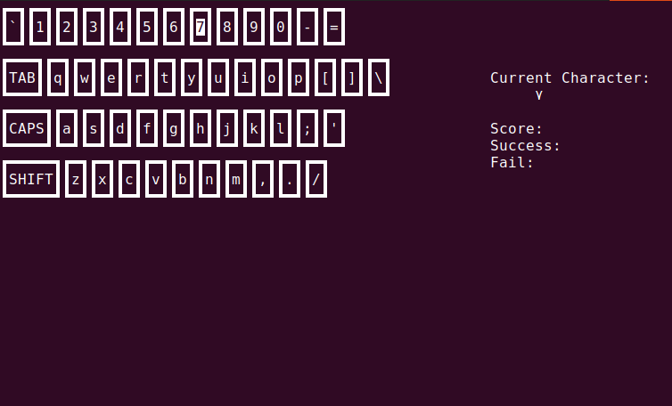
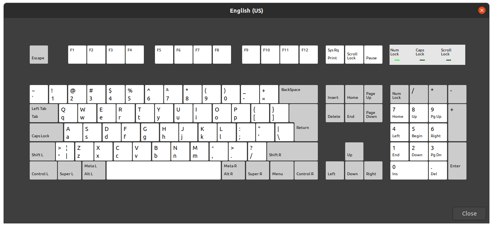
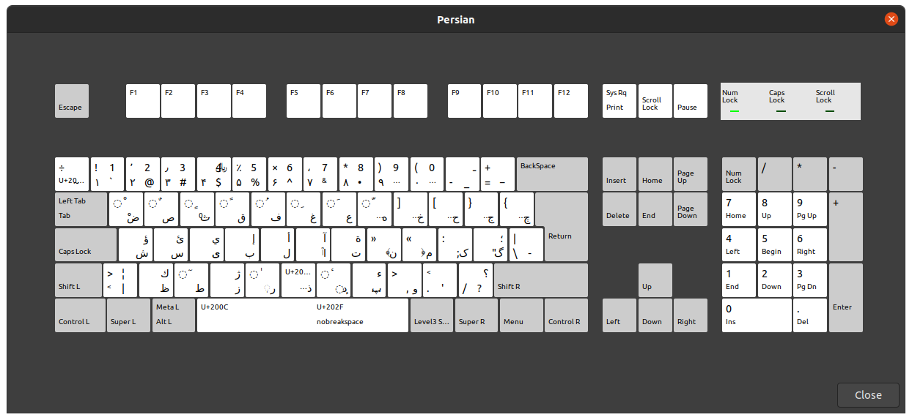

# keyboarder  
A typing tutor in python - exploration of fun.  

## Overview and Motivation:  
I can type.  I have been touchtyping for ages and ages relatively error-free.  However as I've been learning Farsi (reasons), I would like to communicate more effectively and that would be for me to learn how to touch type.  My system does come with a Farsi keyboard and visual interface but it becomes a matter of hunt and peck for which is annoying and slow.  
 
So how do people learn to type?  They may take courses, and in this day and age of isolation, we turn to online systems or tutorials.  People enjoy games.  I enjoy the odd game from time to time, so I figured that I'd look for a typing tutor for learning to type in Farsi on an English keyboard.  

I am lousy at developing GUI applications and I normally despise using something other than a shell so I wrote something that would run in a terminal using curses.  I can only hope that you find this useful, watch the skies for updates (refactoring), and more game enhancements.

## Installation:  

Congratulations: you have looked at this file as well as possibly cloned it.  I thank you.

1) Retrieve the repository (you may have already done this):  
$ git clone https://github.com/glebite/keyboarder.git

2) Change directories to the keyboarder file structure:  
$ cd keyboarder

3) Using python3 (yes you will need python3) you will reconsitute the virutal environment:  
(go here for instructions: [Real Python Installation Instructions](https://realpython.com/installing-python/)  
$ python3 -m pip install -r requirements.txt

4) Activate your virtual environment for keyboarder:  
$ source venv/bin/activate

5) Get to and execute 'game':  
$ cd src  
$ python3 game.py ../data/game_1.cfg

6) Enjoy what it is for now:
  

7) Deactivate your virtual environment  
$ deactivate

8) Clap and celebrate having had some fun and trying this out  
$ sudo human --action celebrate

## What is next?  

0) Accept feedback with grace;  
1) Increase the number of unit tests;  
2) Refactor the keyplayer;  
3) Build a game class for handling new rules for scoring;  
4) Buff the documentation;  
5) Advertise somewhere with a bigger audience;  
6) Move the display to a web application;
7) Oh yeah - make use of it;  :)  
8) SHIFT key and Upper case characters.

## Contributing:  
Complaints? Bugs?  Questions? Ideas? 

Follow the github issue tracker.

## Credits:  
This application was created by glebite.  I am @glebite on [github](http://www.github.com/glebite).

## Pictures are awesome:  

  
     

## Game composition notes:  

1) -- Random character selection with hints, # characters --
2) -- Random character selection without hints, # characters --
3) -- Random character selection with hints, # characters, timed --  
4) -- Random character selection without hints, # characters, timed --  
5) Simple words with hints  
6) Simple words with hints and timed  
7) Simple words without hints  
8) Simple words without hints and timed  

